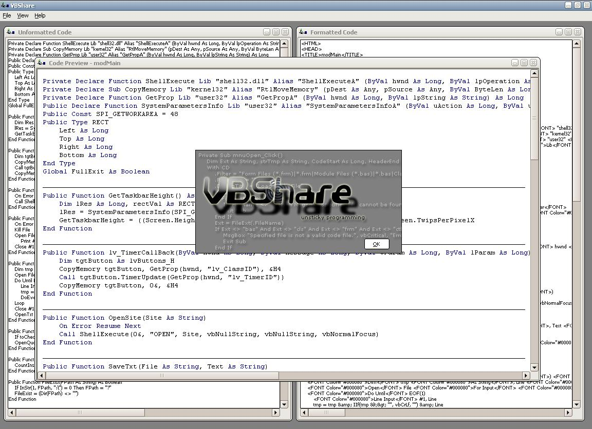



## VBShare

### Description

VBShare will format your VB6 code (and probably lower, but I coded it with VB6 in mind, and used it as a reference) with HTML to make sharing your code easier. VBShare will highlight both forms of comments and most, if not all, keywords, and shouldnt return any false positives for either. Default colors for the HTML are the same as in VB, green for comments (#008000), blue for keywords (#000080), black for normal text, and white for background. All colors, including program font colors (and program fonts), are customizable in the preferences section. HTML format includes a 'water-mark', which you can edit in the preferences section, as well. The water-mark is just a block of customizable text, which can have HTML tags in it. The program also features a preview window, where you can view the current state of the HTML, so you can make changes before saving the final product. Also included is a print function which will allow you to print either the raw VB code or the HTML formatted code. This project is not quite finished, but I sort of lost interest in working on it, in the end, hence the release of the source. As you might be able to tell, I was planning on making it quite extensive and selling copies, but my lack of interest squashed all hopes of finacial gain, from this project. You'll see the list of serials, and Serial BAS (modSerial.bas), and the prompt for a serial on the splash screen; all of which are remanents of such hopes. When you run the project, or exe, just pick a serial off the list and put it in the text box, either that or remove the serials all-together. Feed-back and comments are always appriciated, and thanks for any positive comments made. I'd also appriciate it if you'd take a minute or two and visit my site, http://unsticky.net.

- unsticky

unsticky programming

unsticky.net
 
### More Info
 

             |
---                |---
**Submitted On**   |2005-10-19 19:34:10
**By**             |[unsticky](https://github.com/Planet-Source-Code/PSCIndex/blob/master/ByAuthor/unsticky.md)
**Level**          |Intermediate
**User Rating**    |5.0 (20 globes from 4 users)
**Compatibility**  |VB 5\.0, VB 6\.0
**Category**       |[Internet/ HTML](https://github.com/Planet-Source-Code/PSCIndex/blob/master/ByCategory/internet-html__1-34.md)
**World**          |[Visual Basic](https://github.com/Planet-Source-Code/PSCIndex/blob/master/ByWorld/visual-basic.md)
**Archive File**   |[VBShare19417510192005\.zip](https://github.com/Planet-Source-Code/unsticky-vbshare__1-62955/archive/master.zip)

